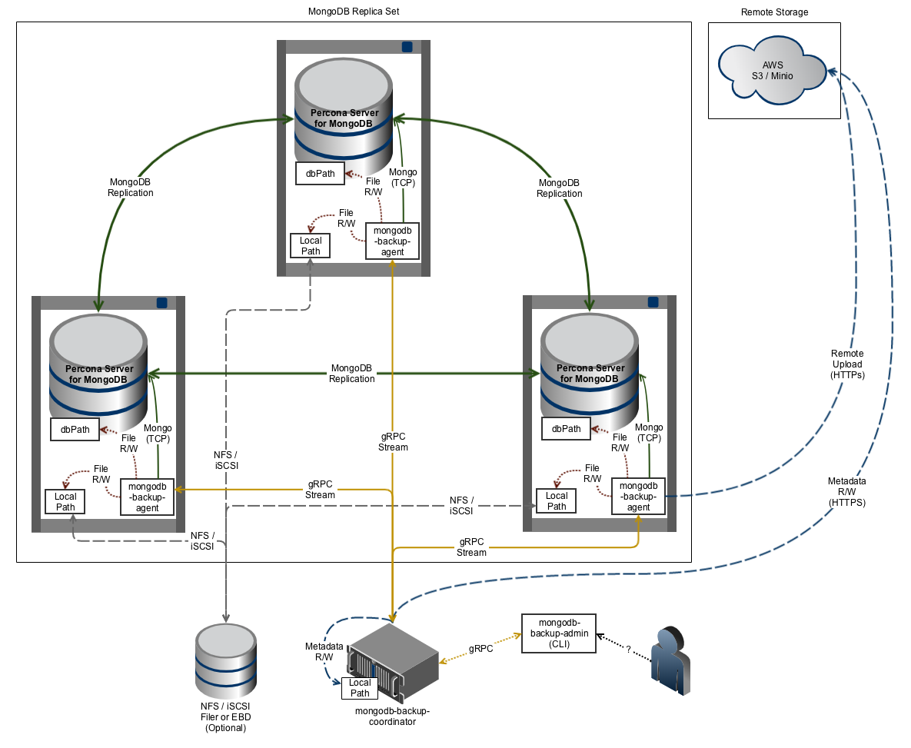

.. _pbm.architecture:

Architecture
********************************************************************************

|pbm| uses a distributed client-server architecture to perform backup and
restore actions. This architecture provides the maximum scalability and
flexibility.

.. contents::
   :local:

   The architecture of |pbm|

.. _pbm.architecture.coordinator:

Backup Coordinator
================================================================================

The |backup-coordinator| is a service that transparently handles communication
with backup agents (started with |pbm-agent|)and the backup control program
(|pbmctl|).

The main function of the |bc| is to gather information from the
|mongod| instances through the agents to determine which nodes should run
backup or restore and to establish consistent backup and restore points across
all shards.

The |backup-coordinator| listens on 2 TCP ports:

RPC
   Port used for agent communications (Default: 10000/tcp)
API
   Port used for CLI/API communications (Default: 10001/tcp)

.. _pbm.architecture.agent:

|pbm-agent|
================================================================================

Backup agents (instances of |pbm-agent|) receive commands from the
|backup-coordinator|.

An instance of |pbm-agent| must run locally (connected to 'localhost') on every
|mongod| instance and config servers in order to collect
information about the instance and to forward it to the
|backup-coordinator|. The |backup-coordinator| uses this information to
determine the best agent to start a backup or restore, to start or stop the
balancer, and so on.

The agent requires outbound network access to the :ref:`backup coordinator
<pbm.architecture.coordinator>` RPC port.

.. _pbm.architecture.pbmctl:

PBM Control (|pbmctl|)
================================================================================

This program is a command line utility to send commands to the coordinator.
Currently, the available commands are:

==============  ================================================================
Command         Description
==============  ================================================================
list nodes      List all nodes (agents) connected to the coordinator
list backups    List all finished backups.
list storage    List all storages configured via |pbm-agent| on one of the
                members of the replica set.
run backup      Start a new backup
run restore     Restore a backup
==============  ================================================================

The |pbmctl| utility requires outbound network access to the :ref:`backup
coordinator <pbm.architecture.coordinator>`.

.. include:: .res/replace.txt
