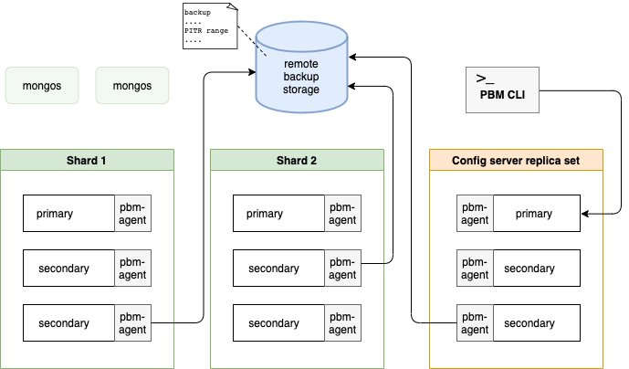
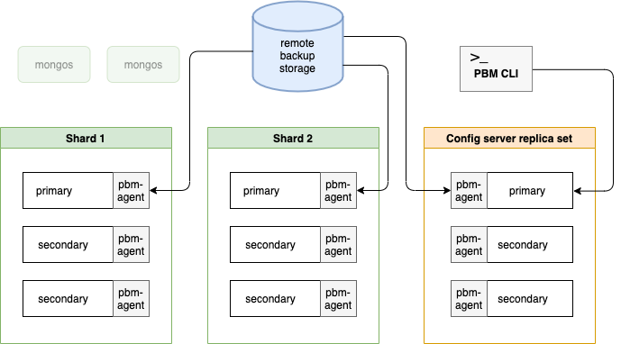

.. _pbm.running:

Running |pbm|
********************************************************************************

This document provides examples of using |pbm.app| commands to operate your backup system. For detailed description of pbm commands, refer to :ref:`pbm-commands`.

.. contents::
   :local:
   :backlinks: top

.. _pbm.running.backup.listing:

Listing backups
--------------------------------------------------------------------------------

To view all completed backups, run the |pbm-list| command.

.. code-block:: bash

   $ pbm list

As of version 1.4.0, the |pbm-list| output shows the completion time.

.. admonition:: Sample output

   .. code-block:: text

      Backup snapshots:
        2021-01-13T15:50:54Z [complete: 2021-01-13T15:53:40]
        2021-01-13T16:10:20Z [complete: 2021-01-13T16:13:00]
        2021-01-20T17:09:46Z [complete: 2021-01-20T17:10:33]

.. _pbm.running.backup.starting:

Starting a backup
--------------------------------------------------------------------------------

.. code-block:: bash

   $ pbm backup 

By default, |PBM| uses ``s2`` compression method when making a backup. 
You can start a backup with a different compression method by passing the ``--compression`` flag to the |pbm-backup| command. 

For example, to start a backup with gzip compression, use the following command

.. code-block:: bash

   $ pbm backup --compression=gzip 

Supported compression types are: ``gzip``, ``snappy``, ``lz4``, ``pgzip``.  The ``none`` value means no compression is done during
backup.

.. rubric:: Backup in sharded clusters

.. important::

   For PBM v1.0 (only): before running |pbm-backup| on a cluster, stop the
   balancer.

In sharded clusters, one of |pbm-agent| processes for every shard and the config server replica set writes backup snapshots and :term:`oplog slices <Oplog slice>` into the remote backup storage directly. To learn more about oplog slicing, see :ref:`pitr`.

The ``mongos`` nodes are not involved in the backup process.

The following diagram illustrates the backup flow.

|

Checking an in-progress backup
--------------------------------------------------------------------------------

.. important::

   As of version 1.4.0, the information about running backups is not available in the |pbm-list| output. Use the :command:`pbm status` command instead to check for running backups. See :ref:`pbm-status` for more information.

For |PBM| version 1.3.4 and earlier, run the |pbm-list| command and you will see the running backup listed with a
'In progress' label. When that is absent, the backup is complete.

.. _pbm.running.backup.restoring:

Restoring a backup
--------------------------------------------------------------------------------

.. warning::

   Backups made with |PBM| prior to v1.5.0 are incompatible for restore with |PBM| v1.5.0 and later. This is because processing of system collections ``Users`` and ``Roles`` has changed: in v1.5.0, ``Users`` and ``Roles`` are copied to temporary collection during backup and must be present in the backup during restore. In earlier versions of |PBM|, ``Users`` and ``Roles`` are copied to a temporary collection during restore. Therefore, restoring from these backups with |PBM| v1.5.0 isn't possible. 

   The recommended approach is to make a fresh backup after :ref:`upgrading Percona Backup for MongoDB <pbm.upgrade>` to version 1.5.0.

To restore a backup that you have made using |pbm-backup|, use the
|pbm-restore| command supplying the time stamp of the backup that you intend to
restore.

.. important::

   Consider these important notes on restore operation:

   1. |pbm| is designed to be a full-database restore tool. As of version <=1.x, it performs a full all-databases, all collections restore and does not offer an option to restore only a subset of collections in the backup, as MongoDB's ``mongodump`` tool does. But to avoid surprising ``mongodump`` users, as of versions 1.x, |pbm| replicates mongodump's behavior to only drop collections in the backup. It does not drop collections that are created new after the time of the backup and before the restore. Run a ``db.dropDatabase()`` manually in all non-system databases (these are all databases except "local", "config" and "admin") before running |pbm-restore| if you want to guarantee that the post-restore database only includes collections that are in the backup.
   2. Whilst the restore is running, prevent clients from accessing the database. The data will naturally be incomplete whilst the restore is in progress, and writes the clients make cause the final restored data to differ from the backed-up data.
   3. If you enabled :term:`Point-in-Time Recovery`, disable it before running |pbm-restore|. This is because |PITR| incremental backups and restore are incompatible operations and cannot be run together.

.. code-block:: bash

   $ pbm restore 2019-06-09T07:03:50Z

.. versionadded:: 1.3.2

   The |pbm| config includes the restore options to adjust the memory consumption by the |pbm-agent| in environments with tight memory bounds. This allows preventing out of memory errors during the restore operation.

.. code-block:: yaml

   restore:
     batchSize: 500
     numInsertionWorkers: 10

The default values were adjusted to fit the setups with the memory allocation of 1GB and less for the agent.

.. note::

  The lower the values, the less memory is allocated for the restore. However, the performance decreases too.

.. rubric:: Restoring a backup in sharded clusters

.. important::

   As preconditions for restoring a backup in a sharded cluster, complete the following steps:

   1. Stop the balancer.
   2. Shut down all ``mongos`` nodes to stop clients from accessing the database while restore is in progress. This ensures that the final restored data doesn’t differ from the backed-up data.
   3. Disable point-in-time recovery if it is enabled. To learn more about point-in-time recovery, see :ref:`pitr`.

Note that you can restore a sharded backup only into a sharded environment. It can be your existing cluster or a new one. To learn how to restore a backup into a new environment, see :ref:`pbm.restore-new-env`.

During the restore, the |pbm-agent| processes write data to primary nodes in the cluster. The following diagram shows the restore flow.

|

After a cluster's restore is complete, restart all ``mongos`` nodes to reload the sharding metadata.

.. _pbm.restore-new-env:

.. rubric:: Restoring a backup into a new environment

To restore a backup from one environment to another, consider the following key points about the destination environment:

* Replica set names (both the config servers and the shards) in your new destination cluster and in the cluster that was backed up must be exactly the same.

* |PBM| configuration in the new environment must point to the same remote storage that is defined for the original environment, including the authentication credentials if it is an object store. Once you run |pbm-list| and see the backups made from the original environment, then you can run the |pbm-restore| command.

  Of course, make sure not to run |pbm-backup| from the new environment whilst the |PBM| config is pointing to the remote storage location of the original environment.

.. _pbm.cancel.backup:

Canceling a backup
--------------------------------------------------------------------------------

You can cancel a running backup if, for example, you want to do
another maintenance of a server and don't want to wait for the large backup to finish first.

To cancel the backup, use the :command:`pbm cancel-backup` command.

.. code-block:: bash

  $ pbm cancel-backup
  Backup cancellation has started

After the command execution, the backup is marked as canceled in the |pbm-list| output:

.. code-block:: bash

  $ pbm list
  ...
  2020-04-30T18:05:26Z	Canceled at 2020-04-30T18:05:37Z

.. _pbm.backup.delete:

Deleting backups
--------------------------------------------------------------------------------

Use the :command:`pbm delete-backup` command to delete a specified backup or all backups
older than the specified time.

The command deletes the backup regardless of the remote storage used:
either S3-compatible or a filesystem-type remote storage.

.. note::

  You can only delete a backup that is not running (has the "done" or the "error" state). 

  As of version 1.4.0, |pbm-list| shows only successfully completed backups. To check for backups with other states, run :command:`pbm status`. 

To delete a backup, specify the ``<backup_name>`` as an argument.

.. code-block:: bash

  $ pbm delete-backup 2020-12-20T13:45:59Z

By default, the :command:`pbm delete-backup` command asks for your confirmation
to proceed with the deletion. To bypass it, add the ``-f`` or
``--force`` flag.

.. code-block:: bash

  $ pbm delete-backup --force 2020-04-20T13:45:59Z

To delete backups that were created before the specified time, pass the ``--older-than`` flag to the :command:`pbm delete-backup`
command. Specify the timestamp as an argument
for :command:`pbm delete-backup` in the following format:

* ``%Y-%M-%DT%H:%M:%S`` (for example, 2020-04-20T13:13:20) or
* ``%Y-%M-%D`` (2020-04-20).

.. code-block:: bash

 $ #View backups
 $ pbm list
 Backup snapshots:
   2020-04-20T20:55:42Z   
   2020-04-20T23:47:34Z
   2020-04-20T23:53:20Z
   2020-04-21T02:16:33Z
 $ #Delete backups created before the specified timestamp
 $ pbm delete-backup -f --older-than 2020-04-21
 Backup snapshots:
   2020-04-21T02:16:33Z

.. _pbm.logs:

Viewing backup logs
--------------------------------------------------------------------------------

As of version 1.4.0, you can see the logs from all ``pbm-agents`` in your MongoDB environment using ``pbm CLI``. This reduces time for finding required information when troubleshooting issues.

To view |pbm-agent| logs, run the :command:`pbm logs` command and pass one or several flags to narrow down the search.

The following flags are available:

-	``-t``, ``--tail`` - Show the last N rows of the log
-	``-e``, ``--event`` - Filter logs by all backups or a specific backup
-	``-n``, ``--node`` - Filter logs by a specific node  or a replica set
-	``-s``, ``--severity`` - Filter logs by severity level. The following values are supported (from low to high):

   - D - Debug
   - I - Info
   - W - Warning
   - E - Error
   - F - Fatal
   
- ``-o``, ``--output`` - Show log information as text (default) or in JSON format.
- ``-i``, ``--opid`` - Filter logs by the operation ID

.. rubric:: Examples

The following are some examples of filtering logs:

**Show logs for all backups**

.. code-block:: bash

   $ pbm logs --event=backup

**Show the last 100 lines of the log about a specific backup 2020-10-15T17:42:54Z**

.. code-block:: bash

   $ pbm logs --tail=100 --event=backup/2020-10-15T17:42:54Z

**Include only errors from the specific replica set**

.. code-block:: bash

   $ pbm logs -n rs1 -s E

The output includes log messages of the specified severity type and all higher levels. Thus, when ERROR is specified, both ERROR and FATAL messages are shown in the output.

.. rubric:: Implementation details

``pbm-agents`` write log information into the ``pbmLog`` collection in the :term:`PBM Control collections`. Every |pbm-agent| also writes log information to stderr so that you can retrieve it when there is no healthy mongod node in your cluster or replica set. For how to view an individual |pbm-agent| log, see :ref:`pbm-agent.log`.

Note that log information from ``pbmLog`` collection is shown in the UTC timezone and from the stderr - in the server's time zone.

.. include:: .res/replace.txt
